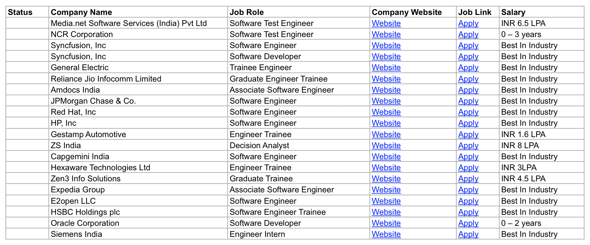

# job-cli [WIP]
cli-tool for apply to jobs easily[WIP]


Generated xls



#### why
> Finding jobs can be hard, cli-jobs scrapes websites and collect data about them from several websites to make applying to job more easier and faster

#### Usage 
```
usage: job-cli.py [-h] [--n N] [--parser PARSER] outdir

Job cli, tool for finding jobs

positional arguments:
  outdir           Output dir for excel

optional arguments:
  -h, --help       show this help message and exit
  --n N            number of jobs to be scraped
  --parser PARSER  Website to be used for scraping
```
#### Note
> currently available for only india  🇮🇳.

#### MIT License

Copyright (c) 2020 aniket sharma